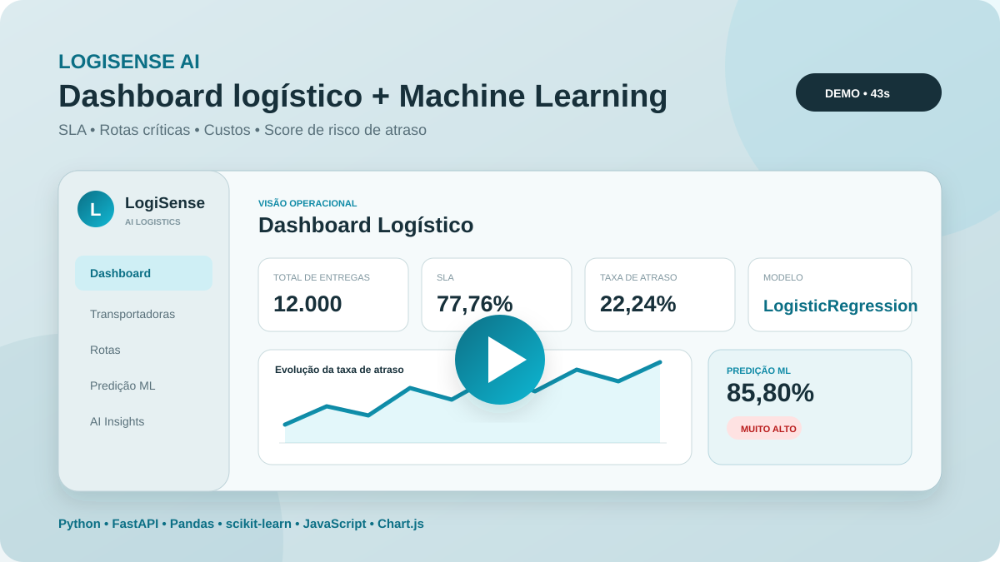
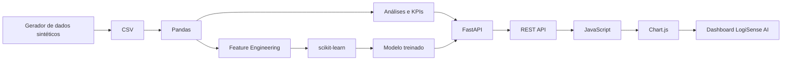

# LogiSense AI

<p align="center">
  <strong>Dashboard logístico end-to-end para análise operacional e previsão de risco de atraso com Machine Learning.</strong>
</p>

<p align="center">
  
  
  
  
  
  
</p>

<p align="center">
  <a href="https://youtu.be/eqGDLbuvB0c">
    
  </a>
</p>

<p align="center">
  <a href="https://youtu.be/eqGDLbuvB0c"><strong>▶ Assistir à demonstração completa</strong></a>
</p>

> **Projeto de portfólio.** Todos os dados são sintéticos e foram gerados exclusivamente para estudo, experimentação e demonstração técnica.

---

## Visão geral

O **LogiSense AI** simula uma operação logística e integra, em um único projeto:

- geração e tratamento de dados;
- análise de KPIs logísticos;
- API REST com FastAPI;
- dashboard interativo;
- visualização de dados com Chart.js;
- pipeline de Machine Learning;
- inferência de risco de atraso em novas entregas.

A versão atual trabalha com uma base de **12.000 entregas sintéticas** e permite explorar desempenho de transportadoras, rotas críticas, SLA, custos de frete e risco de atraso.

---

## O que o projeto entrega

| Área | Funcionalidades |
|---|---|
| **Analytics** | KPIs de entregas, SLA, atraso e frete |
| **Transportadoras** | volume, atraso médio, custo médio e SLA |
| **Rotas** | comparação por origem/destino, distância e atraso médio |
| **Série temporal** | evolução mensal de entregas, atrasos e custos |
| **Insights** | destaques automáticos sobre desempenho e criticidade |
| **Machine Learning** | score de risco de atraso para novas entregas |
| **API** | endpoints REST para dados, catálogos, métricas e inferência |
| **Frontend** | dashboard responsivo com navegação, gráficos e simulador |

---

## Demonstração

A demo mostra o fluxo principal da aplicação:

1. visão geral dos KPIs;
2. evolução mensal da taxa de atraso;
3. desempenho das transportadoras;
4. rotas críticas e insights;
5. navegação pela sidebar;
6. simulação de risco no módulo de Machine Learning;
7. comparação entre cenários de risco alto e baixo.

**[▶ Abrir vídeo da demonstração](https://youtu.be/eqGDLbuvB0c)**

---

## Arquitetura



### Fluxo de uma predição

```text
Usuário
  ↓
Formulário do dashboard
  ↓
JavaScript
  ↓
POST /predict-delay
  ↓
FastAPI + Pydantic
  ↓
Feature Engineering
  ↓
Pipeline scikit-learn
  ↓
Score + classificação de risco
  ↓
Resposta JSON
  ↓
Dashboard
```

---

## Machine Learning

O problema é tratado como uma classificação binária:

```python
atrasou = (atraso_dias > 0).astype(int)
```

### Features utilizadas

**Numéricas**

- `valor_frete`
- `peso_kg`
- `sla_dias`
- `distancia_km`
- `frete_por_kg`
- `km_por_dia_sla`
- `mes`
- `dia_semana`
- `fim_semana`

**Categóricas**

- `transportadora_nome`
- `cd_nome`
- `rota`

### Feature engineering

```python
frete_por_kg = valor_frete / peso_kg
km_por_dia_sla = distancia_km / sla_dias
```

As features numéricas passam por `StandardScaler` e as categóricas por `OneHotEncoder(handle_unknown="ignore")`.

---

## Seleção do modelo

Foram comparados três algoritmos no conjunto de validação:

| Modelo | ROC-AUC | PR-AUC | F1 | Recall |
|---|---:|---:|---:|---:|
| Logistic Regression | **0.7160** | **0.4099** | **0.4735** | **0.6840** |
| Random Forest | 0.7028 | 0.4017 | 0.4463 | 0.4519 |
| Extra Trees | 0.7044 | 0.4067 | 0.4572 | 0.5605 |

O modelo selecionado foi:

```text
LogisticRegression
```

A seleção foi feita por **PR-AUC** no conjunto de validação. Em seguida, o threshold foi ajustado para maximizar o **F1-score**:

```text
threshold = 0.5444
```

Depois da seleção, o modelo foi retreinado com treino + validação e avaliado no conjunto de teste mantido separado.

---

## Avaliação final

| Métrica | Teste |
|---|---:|
| Accuracy | 0.6783 |
| Balanced Accuracy | 0.6544 |
| Precision | 0.3464 |
| Recall | 0.6133 |
| F1-score | 0.4427 |
| ROC-AUC | 0.7127 |
| PR-AUC | 0.3741 |

Matriz de confusão:

```text
[[991, 434],
 [145, 230]]
```

O conjunto de teste contém **1.800 registros** e cobre o período de **23/06/2026 a 23/09/2026**.

### Por que a accuracy não é usada isoladamente?

O baseline da classe majoritária é **0.7917**. Portanto, uma accuracy aparentemente alta poderia ser obtida simplesmente favorecendo a classe mais frequente.

Por isso, o projeto considera também **Balanced Accuracy, Recall, F1, ROC-AUC e PR-AUC**, métricas mais informativas para o objetivo de identificar atrasos.

> O valor mostrado no dashboard é um **score de risco**, não uma probabilidade calibrada.

---

## Divisão temporal

Os dados são ordenados cronologicamente antes da separação:

| Conjunto | Proporção | Período |
|---|---:|---|
| Treino | 70% | 01/01/2025 a 21/03/2026 |
| Validação | 15% | 21/03/2026 a 23/06/2026 |
| Teste | 15% | 23/06/2026 a 23/09/2026 |

Essa estratégia evita uma divisão aleatória puramente retrospectiva e aproxima o experimento do cenário de aprender com dados passados para avaliar dados futuros.

---

## API

Servidor local padrão:

```text
http://127.0.0.1:8000
```

Swagger:

```text
http://127.0.0.1:8000/docs
```

### Endpoints disponíveis

| Método | Endpoint | Descrição |
|---|---|---|
| GET | `/` | status e informações da API |
| GET | `/kpis` | KPIs gerais da operação |
| GET | `/transportadoras` | métricas por transportadora |
| GET | `/rotas` | métricas por rota |
| GET | `/serie-mensal` | evolução mensal |
| GET | `/catalogos` | dados para os selects do simulador |
| GET | `/ml-status` | status do artefato de ML |
| GET | `/model-metrics` | métricas salvas do treinamento |
| POST | `/predict-delay` | inferência de risco de atraso |

### Exemplo de requisição

```json
{
  "data_pedido": "2026-09-24",
  "transportadora_id": 5,
  "cd_id": 2,
  "rota_id": 3,
  "valor_frete": 980,
  "peso_kg": 780,
  "sla_dias": 1
}
```

### Exemplo de resposta

```json
{
  "modelo": "LogisticRegression",
  "score_risco_pct": 89.48,
  "threshold_pct": 54.44,
  "nivel_risco": "Muito alto",
  "predicao_atraso": true,
  "transportadora": "VelozOne",
  "centro_distribuicao": "CD Cajamar",
  "rota": "São Paulo/SP -> Belo Horizonte/MG",
  "distancia_km": 590.0,
  "sla_dias": 1
}
```

Documentação detalhada: **[docs/API.md](docs/API.md)**.

---

## Estrutura do projeto

```text
logisense-ai/
├── backend/
│   ├── app/
│   │   └── main.py
│   ├── ml/
│   │   ├── train_model.py
│   │   ├── delay_model.joblib
│   │   └── metrics.json
│   └── requirements.txt
│
├── data/
│   ├── raw/
│   └── raw_v1/
│
├── docs/
│   ├── images/
│   │   └── demo-thumbnail.svg
│   ├── API.md
│   ├── DATA_DICTIONARY.md
│   ├── MODEL_CARD.md
│   ├── ROADMAP.md
│   └── demo.mp4
│
├── frontend/
│   ├── index.html
│   ├── styles.css
│   └── app.js
│
├── sql/
│   └── schema.sql
│
├── generate_data.py
├── CHANGELOG.md
├── .gitattributes
├── .gitignore
└── README.md
```

---

## Tecnologias

| Camada | Tecnologias |
|---|---|
| Dados | Python, Pandas, CSV |
| Machine Learning | scikit-learn, Joblib |
| Backend | FastAPI, Uvicorn, Pydantic |
| Frontend | HTML5, CSS3, JavaScript |
| Visualização | Chart.js |
| Modelagem | SQL |
| Versionamento | Git, GitHub |

---

## Como executar localmente

### 1. Clone o repositório

```bash
git clone https://github.com/dudxzz-25/logisense-ai.git
cd logisense-ai
```

### 2. Crie o ambiente virtual

**Windows PowerShell**

```powershell
cd backend
python -m venv .venv
.\.venv\Scripts\Activate.ps1
```

**Linux/macOS**

```bash
cd backend
python3 -m venv .venv
source .venv/bin/activate
```

### 3. Instale as dependências

```bash
pip install -r requirements.txt
```

### 4. Inicie a API

```bash
python -m uvicorn app.main:app --reload
```

A API ficará disponível em:

```text
http://127.0.0.1:8000
```

### 5. Inicie o frontend

Abra outro terminal:

```bash
cd frontend
python -m http.server 5500
```

Acesse:

```text
http://127.0.0.1:5500
```

---

## Gerando os dados sintéticos

Na raiz do projeto:

```bash
python generate_data.py
```

O gerador usa seed fixa e simula diferentes níveis de risco com base em fatores como:

- transportadora;
- centro de distribuição;
- rota;
- distância;
- SLA;
- peso;
- dia da semana;
- sazonalidade.

A intenção é criar um conjunto de dados reproduzível com padrões suficientes para análises e experimentos de ML, sem utilizar dados reais.

---

## Treinando o modelo novamente

Na raiz do projeto, com o ambiente virtual ativo:

```bash
python backend/ml/train_model.py
```

O pipeline:

1. carrega e combina os dados;
2. cria o target;
3. executa feature engineering;
4. separa treino, validação e teste temporalmente;
5. treina os modelos candidatos;
6. compara os resultados por PR-AUC;
7. otimiza o threshold no conjunto de validação;
8. retreina o modelo selecionado;
9. avalia no teste;
10. salva artefato e métricas.

Arquivos gerados:

```text
backend/ml/delay_model.joblib
backend/ml/metrics.json
```

---

## Documentação

| Documento | Conteúdo |
|---|---|
| **[API Reference](docs/API.md)** | endpoints, payloads e respostas |
| **[Data Dictionary](docs/DATA_DICTIONARY.md)** | estrutura da base sintética |
| **[Model Card](docs/MODEL_CARD.md)** | metodologia, métricas e limitações do modelo |
| **[Roadmap](docs/ROADMAP.md)** | funcionalidades concluídas e próximas evoluções |
| **[Changelog](CHANGELOG.md)** | histórico das principais versões |

---

## Decisões técnicas

**Dados sintéticos.** A base não contém dados reais de clientes, pedidos ou transportadoras.

**Split temporal.** O modelo é treinado com registros anteriores e testado em um período posterior.

**PR-AUC para seleção.** A métrica foi priorizada devido ao desbalanceamento do target.

**Threshold personalizado.** O ponto de corte foi escolhido no conjunto de validação com base em F1-score.

**Sem leakage operacional.** Variáveis que só existem após o resultado da entrega não entram como features de inferência.

**Score, não probabilidade.** A saída do classificador é apresentada como score de risco, pois não foi realizada calibração probabilística.

---

## Limitações atuais

- dados exclusivamente sintéticos;
- execução local;
- persistência operacional em CSV;
- ausência de autenticação;
- sem integração com sistemas logísticos reais;
- sem calibração probabilística;
- sem explicabilidade por predição;
- sem monitoramento de data/model drift;
- sem retreinamento automático;
- sem deploy em cloud nesta versão.

---

## Próximas evoluções

- persistência em PostgreSQL;
- pipeline ETL estruturado;
- modelo estrela analítico;
- filtros avançados no dashboard;
- testes automatizados;
- explicabilidade do modelo;
- monitoramento de drift;
- Docker;
- CI/CD;
- deploy em cloud.

Acompanhe o planejamento em **[docs/ROADMAP.md](docs/ROADMAP.md)**.

---

## Status do projeto

```text
Versão: v0.4.0
Status: funcional e em evolução
```

---

## Autor

**Eduardo de Toledo Dias**

Projeto desenvolvido para portfólio com foco em **Data Analytics, Machine Learning, APIs e desenvolvimento end-to-end**.
