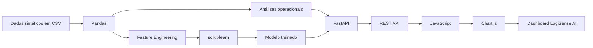

# LogiSense AI

<p align="center">
  <strong>Dashboard logístico end-to-end com análise operacional e Machine Learning para previsão de risco de atraso.</strong>
</p>

<p align="center">
  Python • FastAPI • Pandas • scikit-learn • JavaScript • Chart.js
</p>

<p align="center">
  
</p>

> **Nota:** os dados utilizados neste projeto são sintéticos e foram gerados exclusivamente para estudo e portfólio.

---

## Sobre o projeto

O **LogiSense AI** simula uma operação logística completa, reunindo análise de dados, API, visualização interativa e Machine Learning em uma única aplicação.

O dashboard permite acompanhar:

- total de entregas;
- SLA;
- taxa de atraso;
- custo de frete;
- evolução mensal dos atrasos;
- desempenho de transportadoras;
- rotas críticas;
- insights operacionais;
- score de risco de atraso para novas entregas.

A base atual possui **12.000 entregas sintéticas** distribuídas entre transportadoras, centros de distribuição, rotas e diferentes condições operacionais.

---

## Demonstração

Foi gravada uma demonstração curta do fluxo principal do sistema, incluindo:

1. visão geral dos KPIs;
2. gráficos de atrasos e SLA;
3. rotas críticas e insights;
4. navegação pela sidebar;
5. simulação no módulo de Predição ML;
6. comparação entre cenários de risco alto e baixo.

O vídeo será publicado junto ao material final de portfólio. A thumbnail acima já representa a identidade visual da demo.

---

## Principais funcionalidades

### Dashboard operacional

Visualização consolidada dos principais indicadores logísticos:

- entregas analisadas;
- SLA;
- taxa de atraso;
- custo total de frete;
- evolução temporal;
- ranking de transportadoras.

### Rotas críticas

A aplicação identifica rotas com maior atraso médio e exibe:

- origem;
- destino;
- quantidade de entregas;
- atraso médio;
- custo médio de frete.

### AI Insights

A interface gera insights automáticos com base nos dados retornados pela API, destacando, por exemplo:

- transportadora com menor SLA;
- transportadora com melhor desempenho;
- rota com maior atraso médio;
- mês com maior taxa de atraso;
- períodos ainda em andamento.

### Predição de risco de atraso

O usuário informa:

- data do pedido;
- transportadora;
- centro de distribuição;
- rota;
- peso da carga;
- valor do frete;
- SLA contratado.

O frontend envia os dados para `POST /predict-delay`. A API reproduz o mesmo feature engineering utilizado no treinamento e devolve:

- score de risco;
- nível de risco;
- previsão de atraso;
- threshold do modelo;
- distância da rota;
- modelo utilizado.

Os níveis apresentados são:

| Nível | Regra de interpretação |
|---|---|
| Baixo | Score bem abaixo do threshold |
| Moderado | Score próximo do threshold |
| Alto | Score acima do threshold |
| Muito alto | Score significativamente acima do threshold |

> O valor exibido é tratado como **score de risco**, e não como probabilidade calibrada.

---

## Machine Learning

O target utilizado é:

```python
atrasou = atraso_dias > 0
```

### Features numéricas

- `valor_frete`
- `peso_kg`
- `sla_dias`
- `distancia_km`
- `frete_por_kg`
- `km_por_dia_sla`
- `mes`
- `dia_semana`
- `fim_semana`

### Features categóricas

- `transportadora_nome`
- `cd_nome`
- `rota`

### Feature engineering

```python
frete_por_kg = valor_frete / peso_kg
km_por_dia_sla = distancia_km / sla_dias
```

Também são extraídas informações temporais da data do pedido, como mês, dia da semana e indicador de fim de semana.

---

## Modelos avaliados

Foram comparados três algoritmos:

1. Logistic Regression
2. Random Forest
3. Extra Trees

A seleção foi feita no conjunto de validação com foco em **PR-AUC**.

| Modelo | ROC-AUC | PR-AUC | F1 | Recall |
|---|---:|---:|---:|---:|
| Logistic Regression | 0.7160 | 0.4099 | 0.4735 | 0.6840 |
| Random Forest | 0.7028 | 0.4017 | 0.4463 | 0.4519 |
| Extra Trees | 0.7044 | 0.4067 | 0.4572 | 0.5605 |

Modelo selecionado:

```text
LogisticRegression
```

Threshold otimizado no conjunto de validação:

```text
0.5444
```

---

## Avaliação final

Resultados no conjunto de teste:

| Métrica | Resultado |
|---|---:|
| Accuracy | 0.6783 |
| Balanced Accuracy | 0.6544 |
| Precision | 0.3464 |
| Recall | 0.6133 |
| F1-score | 0.4427 |
| ROC-AUC | 0.7127 |
| PR-AUC | 0.3741 |

Matriz de confusão:

```text
[[991, 434],
 [145, 230]]
```

O conjunto de teste contém **1.800 registros** e cobre o período de **23/06/2026 a 23/09/2026**.

### Por que não olhar apenas Accuracy?

O baseline de accuracy da classe majoritária é **0.7917**. Isso significa que um classificador que previsse apenas a classe mais frequente poderia obter uma accuracy maior, porém teria pouca utilidade para identificar atrasos.

Por isso, o projeto também considera:

- Balanced Accuracy;
- Precision;
- Recall;
- F1-score;
- ROC-AUC;
- PR-AUC.

---

## Divisão temporal

Os dados são ordenados cronologicamente antes da divisão:

```text
70% treino
15% validação
15% teste
```

| Conjunto | Período |
|---|---|
| Treino | 01/01/2025 a 21/03/2026 |
| Validação | 21/03/2026 a 23/06/2026 |
| Teste | 23/06/2026 a 23/09/2026 |

Essa estratégia aproxima melhor o cenário real de aprender com dados passados e avaliar em dados futuros.

---

## Arquitetura



---

## Estrutura do projeto

```text
logisense-ai/
├── backend/
│   ├── app/
│   │   └── main.py
│   ├── ml/
│   │   ├── train_model.py
│   │   ├── delay_model.joblib
│   │   └── metrics.json
│   └── requirements.txt
├── data/
│   ├── raw/
│   └── raw_v1/
├── docs/
│   ├── images/
│   │   └── demo-thumbnail.svg
│   └── ROADMAP.md
├── frontend/
│   ├── index.html
│   ├── styles.css
│   └── app.js
├── sql/
│   └── schema.sql
├── generate_data.py
├── .gitignore
└── README.md
```

---

## API

Servidor local padrão:

```text
http://127.0.0.1:8000
```

Swagger:

```text
http://127.0.0.1:8000/docs
```

### Endpoints

| Método | Endpoint | Descrição |
|---|---|---|
| GET | `/` | Informações básicas da API |
| GET | `/kpis` | KPIs logísticos |
| GET | `/transportadoras` | Métricas por transportadora |
| GET | `/rotas` | Métricas por rota |
| GET | `/serie-mensal` | Evolução mensal |
| GET | `/catalogos` | Transportadoras, CDs e rotas para o simulador |
| GET | `/ml-status` | Status do modelo carregado |
| GET | `/model-metrics` | Métricas salvas do treinamento |
| POST | `/predict-delay` | Inferência de risco de atraso |

Exemplo de requisição:

```json
{
  "data_pedido": "2026-09-24",
  "transportadora_id": 5,
  "cd_id": 2,
  "rota_id": 3,
  "valor_frete": 980,
  "peso_kg": 780,
  "sla_dias": 1
}
```

Exemplo de resposta:

```json
{
  "modelo": "LogisticRegression",
  "score_risco_pct": 89.48,
  "threshold_pct": 54.44,
  "nivel_risco": "Muito alto",
  "predicao_atraso": true,
  "transportadora": "VelozOne",
  "centro_distribuicao": "CD Cajamar",
  "rota": "São Paulo/SP -> Belo Horizonte/MG",
  "distancia_km": 590,
  "sla_dias": 1
}
```

---

## Tecnologias

### Dados e Machine Learning

- Python
- Pandas
- scikit-learn
- Joblib

### Backend

- FastAPI
- Uvicorn
- Pydantic

### Frontend

- HTML5
- CSS3
- JavaScript
- Chart.js

### Desenvolvimento

- Git
- GitHub
- Visual Studio Code

---

## Como executar

### 1. Clone o repositório

```bash
git clone https://github.com/dudxzz-25/logisense-ai.git
cd logisense-ai
```

### 2. Crie e ative o ambiente virtual

No Windows PowerShell:

```powershell
cd backend
python -m venv .venv
.\.venv\Scripts\Activate.ps1
```

### 3. Instale as dependências

```powershell
pip install -r requirements.txt
```

### 4. Inicie a API

```powershell
python -m uvicorn app.main:app --reload
```

Acesse:

```text
http://127.0.0.1:8000/docs
```

### 5. Inicie o frontend

Em outro terminal:

```powershell
cd frontend
python -m http.server 5500
```

Abra:

```text
http://127.0.0.1:5500
```

---

## Treinando novamente o modelo

Na raiz do projeto, com o ambiente virtual ativo:

```powershell
python backend/ml/train_model.py
```

O script:

1. carrega os dados;
2. realiza feature engineering;
3. divide os dados cronologicamente;
4. treina os modelos candidatos;
5. compara a validação;
6. otimiza o threshold;
7. retreina o modelo escolhido;
8. avalia no conjunto de teste;
9. salva o modelo;
10. salva as métricas.

Arquivos gerados:

```text
backend/ml/delay_model.joblib
backend/ml/metrics.json
```

---

## Gerando uma nova base sintética

Na raiz do projeto:

```powershell
python generate_data.py
```

O simulador considera fatores como:

- transportadora;
- centro de distribuição;
- rota;
- distância;
- SLA;
- peso;
- dia da semana;
- sazonalidade.

O objetivo é criar um cenário com sinal estatístico suficiente para análise e ML, sem tornar o target trivialmente determinístico.

---

## Fluxo de uma predição

```text
Usuário
   ↓
Formulário do Dashboard
   ↓
JavaScript
   ↓
POST /predict-delay
   ↓
FastAPI + Pydantic
   ↓
Feature Engineering
   ↓
Modelo scikit-learn
   ↓
Score e nível de risco
   ↓
Resposta JSON
   ↓
Dashboard
```

---

## Decisões técnicas

### Dados sintéticos

O projeto não utiliza dados reais de clientes ou transportadoras. A base foi criada artificialmente para permitir um fluxo completo de Data Analytics e Machine Learning sem expor informações sensíveis.

### PR-AUC

Como o target é desbalanceado, PR-AUC é uma métrica especialmente útil para comparar os modelos.

### Threshold personalizado

O threshold não foi escolhido arbitrariamente: ele foi otimizado no conjunto de validação usando F1-score.

### Score de risco

A saída do classificador não é apresentada como probabilidade calibrada. A interface usa a expressão **score de risco** para evitar uma interpretação estatística mais forte do que o modelo permite.

---

## Limitações atuais

- dados sintéticos;
- execução local;
- armazenamento em CSV;
- sem autenticação;
- sem integração com sistemas logísticos reais;
- sem calibração probabilística;
- sem monitoramento de drift;
- sem retreinamento automático.

---

## Próximos passos

- PostgreSQL;
- filtros avançados;
- testes automatizados;
- Docker;
- deploy;
- explicabilidade do modelo;
- monitoramento de data/model drift;
- CI/CD;
- melhoria da experiência mobile.

Veja também o [roadmap](docs/ROADMAP.md).

---

## Objetivo de portfólio

O LogiSense AI demonstra, em um único projeto:

- análise de dados;
- Python e Pandas;
- desenvolvimento de APIs;
- Machine Learning;
- feature engineering;
- avaliação de modelos;
- integração frontend/backend;
- dashboards interativos;
- visualização de dados;
- desenvolvimento end-to-end.

---

## Status

```text
Versão: v0.4.0
Status: funcional / em evolução
```

---

## Autor

**Eduardo de Toledo Dias**

Projeto de portfólio em **Data Analytics, Machine Learning e Software Development**.
