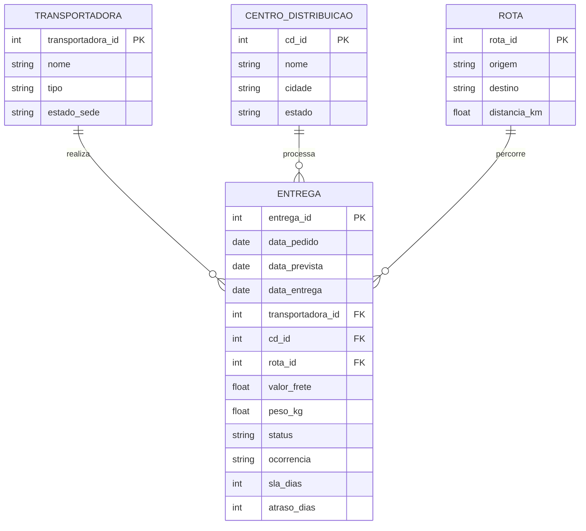

# Data Dictionary — LogiSense AI

Este documento descreve a estrutura da base sintética utilizada pelo projeto.

> Todos os dados são fictícios e foram gerados exclusivamente para estudo e portfólio.

---

## Visão geral

A base é organizada em quatro arquivos CSV principais:

- `entregas.csv`
- `transportadoras.csv`
- `centros_distribuicao.csv`
- `rotas.csv`

O arquivo `entregas.csv` funciona como fato operacional e referencia as demais tabelas por identificadores.

---

## entregas.csv

Uma linha representa uma entrega simulada.

| Campo | Tipo esperado | Descrição |
|---|---|---|
| `entrega_id` | inteiro | Identificador único da entrega |
| `data_pedido` | data | Data em que o pedido foi registrado |
| `data_prevista` | data | Data prevista para conclusão da entrega |
| `data_entrega` | data | Data efetiva da entrega |
| `transportadora_id` | inteiro | Chave da transportadora responsável |
| `cd_id` | inteiro | Chave do centro de distribuição |
| `rota_id` | inteiro | Chave da rota |
| `valor_frete` | decimal | Valor simulado do frete |
| `peso_kg` | decimal | Peso da carga em quilogramas |
| `status` | texto | Situação operacional da entrega |
| `ocorrencia` | texto | Ocorrência logística simulada, quando aplicável |
| `sla_dias` | inteiro | Prazo contratado em dias |
| `atraso_dias` | inteiro | Quantidade de dias de atraso; zero representa entrega dentro do prazo |

### Target utilizado em Machine Learning

```python
atrasou = (atraso_dias > 0).astype(int)
```

O campo `atraso_dias` é utilizado apenas para construção do target durante o treinamento, e não como feature de entrada do modelo.

---

## transportadoras.csv

| Campo | Tipo esperado | Descrição |
|---|---|---|
| `transportadora_id` | inteiro | Identificador da transportadora |
| `nome` | texto | Nome fictício da transportadora |
| `tipo` | texto | Modal de transporte |
| `estado_sede` | texto | UF da sede simulada |

Transportadoras presentes na versão atual:

- RotaSul Logística;
- MoveXpress;
- Nexa Cargo;
- Atlas Transportes;
- VelozOne.

---

## centros_distribuicao.csv

| Campo | Tipo esperado | Descrição |
|---|---|---|
| `cd_id` | inteiro | Identificador do centro de distribuição |
| `nome` | texto | Nome do centro de distribuição |
| `cidade` | texto | Cidade |
| `estado` | texto | UF |

Centros presentes na versão atual:

- CD Guarulhos;
- CD Cajamar;
- CD Campinas;
- CD Curitiba.

---

## rotas.csv

| Campo | Tipo esperado | Descrição |
|---|---|---|
| `rota_id` | inteiro | Identificador da rota |
| `origem` | texto | Cidade/UF de origem |
| `destino` | texto | Cidade/UF de destino |
| `distancia_km` | decimal | Distância simulada da rota em quilômetros |

Rotas presentes na versão atual:

| Origem | Destino | Distância |
|---|---|---:|
| São Paulo/SP | Rio de Janeiro/RJ | 430 km |
| São Paulo/SP | Campinas/SP | 100 km |
| São Paulo/SP | Belo Horizonte/MG | 590 km |
| Curitiba/PR | São Paulo/SP | 410 km |
| Campinas/SP | Ribeirão Preto/SP | 220 km |
| São Paulo/SP | Curitiba/PR | 410 km |
| São Paulo/SP | Santos/SP | 80 km |
| São Paulo/SP | Sorocaba/SP | 100 km |

---

## Relacionamentos



---

## Geração dos dados

A base é produzida por `generate_data.py` com seed fixa para facilitar a reprodutibilidade.

O simulador utiliza fatores de risco fictícios associados a:

- transportadora;
- centro de distribuição;
- rota;
- distância;
- SLA;
- peso;
- dia da semana;
- sazonalidade.

Esses fatores existem para produzir uma base sintética com padrões suficientemente realistas para análise e experimentação com Machine Learning.

---

## Observação sobre leakage

Variáveis geradas após o resultado da entrega, como a ocorrência final e o próprio atraso observado, não são utilizadas como features de entrada na inferência do modelo.

Isso evita fornecer ao classificador informações que só estariam disponíveis depois que a entrega já tivesse ocorrido.
